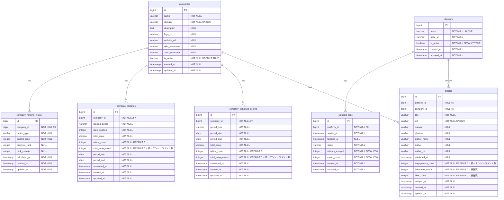

# データベース設計

## 概要

DevCorpTrends プロジェクトにおける企業影響力分析システムのデータベース設計です。
技術コミュニティでの企業の影響力を定量化し、複数期間でのランキング機能を提供します。

## 設計方針

- **企業分析特化**: 企業の技術コミュニティでの影響力測定に特化
- **シンプル設計**: 7テーブルによる最小限かつ十分な設計
- **長期データ保持**: 過去データの永続保存による時系列分析
- **複数期間分析**: 1週間〜全期間の7つの期間別ランキング

## テーブル設計

### 1. 企業テーブル (companies)

企業の基本情報を管理するマスタテーブル

**実装**: `database/migrations/2025_07_05_115213_create_companies_table.php`

**関連migrations**:
- `2025_07_05_204110_add_qiita_username_to_companies_table.php`
- `2025_07_05_212451_add_zenn_username_to_companies_table.php`
- `2025_07_10_110049_add_flexible_matching_columns_to_companies_table.php`

主要カラム：
- `id`: 企業ID（主キー）
- `name`: 企業名
- `domain`: 企業ドメイン（ユニーク）
- `description`: 企業説明
- `logo_url`: ロゴURL
- `website_url`: ウェブサイトURL
- `qiita_username`: Qiitaユーザー名
- `zenn_username`: Zennユーザー名
- `url_patterns`: URLパターンのJSONリスト（CompanyMatcher用）
- `domain_patterns`: ドメインパターンのJSONリスト（CompanyMatcher用）
- `keywords`: キーワードのJSONリスト（CompanyMatcher用）
- `zenn_organizations`: Zenn組織名のJSONリスト（CompanyMatcher用）
- `is_active`: アクティブ状態

### 2. プラットフォームテーブル (platforms)

スクレイピング対象のプラットフォーム情報を管理

**実装**: `database/migrations/2025_07_05_122157_create_platforms_table.php`

主要カラム：
- `id`: プラットフォームID（主キー）
- `name`: プラットフォーム名（ユニーク）
- `base_url`: ベースURL
- `is_active`: アクティブ状態

### 3. 記事テーブル (articles)

各プラットフォームから取得した記事情報を保存

**実装**: `database/migrations/2025_07_05_122604_create_articles_table.php`

主要カラム：
- `id`: 記事ID（主キー）
- `platform_id`: プラットフォームID（外部キー）
- `company_id`: 企業ID（外部キー）
- `title`: 記事タイトル
- `url`: 記事URL（ユニーク）
- `domain`: ドメイン
- `platform`: プラットフォーム識別子
- `author_name`: 著者名
- `author`: 投稿者情報（Qiita用）
- `author_url`: 投稿者URL（Qiita用）
- `published_at`: 公開日時
- `engagement_count`: エンゲージメント数（bookmark_countとlikes_countを統一）
- `bookmark_count`: ブックマーク数（非推奨、engagement_count使用）
- `likes_count`: いいね数（非推奨、engagement_count使用）
- `scraped_at`: スクレイピング日時

**関連migrations**:
- `2025_07_05_193545_add_domain_and_platform_to_articles_table.php`
- `2025_07_05_204208_add_qiita_fields_to_articles_table.php`

### 4. 企業影響力スコアテーブル (company_influence_scores)

企業の影響力スコアを期間別に集計・保存

**実装**: `database/migrations/2025_07_06_085607_create_company_influence_scores_table.php`

主要カラム：
- `id`: スコアID（主キー）
- `company_id`: 企業ID（外部キー）
- `period_type`: 期間タイプ（daily, weekly, monthly）
- `period_start`: 期間開始日
- `period_end`: 期間終了日
- `total_score`: 総スコア
- `article_count`: 記事数
- `total_engagement`: 総エンゲージメント数（統一指標）
- `total_bookmarks`: 総ブックマーク数（非推奨）
- `calculated_at`: 計算日時

### 5. 企業ランキングテーブル (company_rankings)

各期間における企業のランキング情報を保存

**実装**: `database/migrations/2025_07_06_085608_create_company_rankings_table.php`

主要カラム：
- `id`: ランキングID（主キー）
- `company_id`: 企業ID（外部キー）
- `ranking_period`: ランキング期間（1w, 1m, 3m, 6m, 1y, 3y, all）
- `rank_position`: 順位
- `total_score`: 総スコア
- `article_count`: 記事数
- `total_engagement`: 総エンゲージメント数（統一指標）
- `total_bookmarks`: 総ブックマーク数（非推奨）
- `period_start`: 期間開始日
- `period_end`: 期間終了日
- `calculated_at`: 計算日時

### 6. 企業ランキング履歴テーブル (company_ranking_history)

企業の順位変動履歴を記録

**実装**: `database/migrations/2025_07_06_102650_create_company_ranking_history_table.php`

主要カラム：
- `id`: 履歴ID（主キー）
- `company_id`: 企業ID（外部キー）
- `period_type`: 期間タイプ（1w, 1m, 3m, 6m, 1y, 3y, all）
- `current_rank`: 現在の順位
- `previous_rank`: 前回の順位（初回はNULL）
- `rank_change`: 順位変動（正の値：上昇、負の値：下降）
- `calculated_at`: 計算日時

**関連migrations**:
- `2025_07_06_085608_create_company_ranking_histories_table.php`

### 7. スクレイピングログテーブル (scraping_logs)

スクレイピング処理の実行ログを管理

**実装**: `database/migrations/2025_07_06_085608_create_scraping_logs_table.php`

主要カラム：
- `id`: ログID（主キー）
- `platform_id`: プラットフォームID（外部キー）
- `started_at`: 開始日時
- `finished_at`: 終了日時（実行中はNULL）
- `status`: ステータス（success, failed, partial）
- `articles_scraped`: スクレイピング記事数
- `errors_count`: エラー数

## ER図

## インデックス設計

パフォーマンス最適化のための主要インデックス

実装は各migrationファイルに記載されています：

**articles テーブル**:
- `company_id`, `published_at` の複合インデックス
- `platform_id`, `scraped_at` の複合インデックス

**company_rankings テーブル**:
- `ranking_period`, `rank_position` の複合インデックス (`idx_rankings_period_rank`)
- `company_id`, `ranking_period` の複合インデックス (`idx_rankings_company_period`)

**company_influence_scores テーブル**:
- `company_id`, `period_type`, `period_start` の複合インデックス

**company_ranking_history テーブル**:
- `company_id`, `period_type` の複合インデックス
- `period_type`, `calculated_at` の複合インデックス
- `calculated_at` の単一インデックス
- `company_id`, `period_type`, `calculated_at` のユニークインデックス

## 実装状況

全テーブルの実装が完了しています。

### 実装済みテーブル
1. companies - 企業テーブル
2. platforms - プラットフォームテーブル
3. articles - 記事テーブル
4. company_influence_scores - 企業影響力スコアテーブル
5. company_rankings - 企業ランキングテーブル
6. company_ranking_history - 企業ランキング履歴テーブル
7. scraping_logs - スクレイピングログテーブル

詳細な実装は `database/migrations/` ディレクトリの各migrationファイルを参照してください。

## ランキング機能

### 対象期間
- **1w**: 1週間
- **1m**: 1ヶ月
- **3m**: 3ヶ月
- **6m**: 6ヶ月
- **1y**: 1年
- **3y**: 3年
- **all**: 全期間

### 実装戦略
1. **定期バッチ処理**: 毎日深夜にランキング計算
2. **並行処理**: 各期間の集計を並行実行
3. **順位変動追跡**: 前回との比較で変動記録
4. **履歴保持**: 長期的な順位変動の可視化

## 関連ドキュメント

- [プロジェクト概要](プロジェクト概要)
- [技術スタック](技術スタック)
- [開発環境](開発環境)
- [開発フロー](開発フロー)