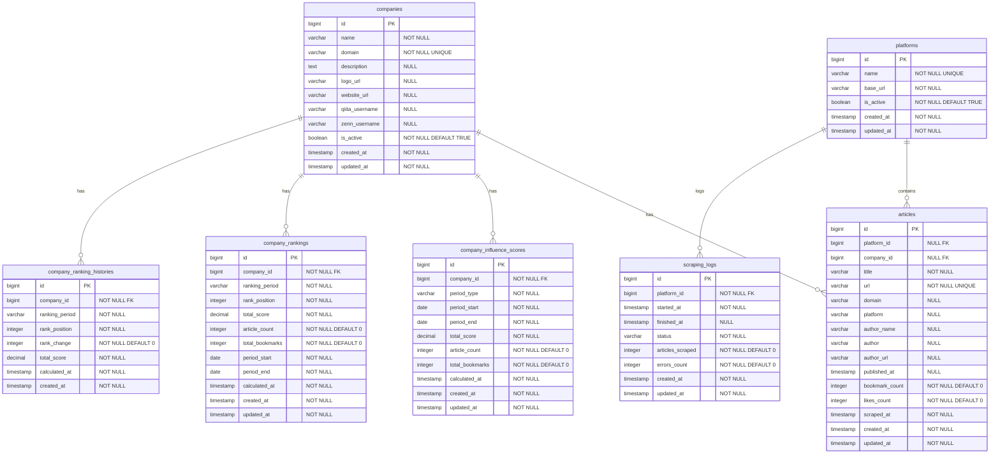

# データベース設計

## 概要

DevCorpTrends プロジェクトにおける企業影響力分析システムのデータベース設計です。
技術コミュニティでの企業の影響力を定量化し、複数期間でのランキング機能を提供します。

## 設計方針

- **企業分析特化**: 企業の技術コミュニティでの影響力測定に特化
- **シンプル設計**: 7テーブルによる最小限かつ十分な設計
- **長期データ保持**: 過去データの永続保存による時系列分析
- **複数期間分析**: 1週間〜全期間の7つの期間別ランキング

## テーブル設計

### 1. 企業テーブル (companies)

企業の基本情報を管理するマスタテーブル

```sql
CREATE TABLE companies (
    id BIGSERIAL PRIMARY KEY,
    name VARCHAR(255) NOT NULL,
    domain VARCHAR(255) NOT NULL UNIQUE,
    description TEXT NULL,
    logo_url VARCHAR(500) NULL,
    website_url VARCHAR(500) NULL,
    qiita_username VARCHAR(255) NULL,    -- Qiitaユーザー名
    zenn_username VARCHAR(255) NULL,     -- Zennユーザー名
    is_active BOOLEAN NOT NULL DEFAULT TRUE,
    created_at TIMESTAMP NOT NULL DEFAULT CURRENT_TIMESTAMP,
    updated_at TIMESTAMP NOT NULL DEFAULT CURRENT_TIMESTAMP
);
```

### 2. プラットフォームテーブル (platforms)

スクレイピング対象のプラットフォーム情報を管理

```sql
CREATE TABLE platforms (
    id BIGSERIAL PRIMARY KEY,
    name VARCHAR(255) NOT NULL UNIQUE,
    base_url VARCHAR(500) NOT NULL,
    is_active BOOLEAN NOT NULL DEFAULT TRUE,
    created_at TIMESTAMP NOT NULL DEFAULT CURRENT_TIMESTAMP,
    updated_at TIMESTAMP NOT NULL DEFAULT CURRENT_TIMESTAMP
);
```

### 3. 記事テーブル (articles)

各プラットフォームから取得した記事情報を保存

```sql
CREATE TABLE articles (
    id BIGSERIAL PRIMARY KEY,
    platform_id BIGINT NULL REFERENCES platforms(id), -- nullable for legacy compatibility
    company_id BIGINT NULL REFERENCES companies(id),   -- nullable for unidentified companies
    title VARCHAR(500) NOT NULL,
    url VARCHAR(1000) NOT NULL UNIQUE,
    domain VARCHAR(255) NULL,          -- extracted domain from URL
    platform VARCHAR(100) NULL,       -- platform identifier string
    author_name VARCHAR(255) NULL,     -- 取得できない場合がある
    author VARCHAR(255) NULL,          -- 投稿者情報（Qiita用）
    author_url VARCHAR(500) NULL,      -- 投稿者URL（Qiita用）
    published_at TIMESTAMP NULL,       -- 取得できない場合がある
    bookmark_count INTEGER NOT NULL DEFAULT 0,
    likes_count INTEGER NOT NULL DEFAULT 0,  -- いいね数（Qiita用）
    scraped_at TIMESTAMP NOT NULL,
    created_at TIMESTAMP NOT NULL DEFAULT CURRENT_TIMESTAMP,
    updated_at TIMESTAMP NOT NULL DEFAULT CURRENT_TIMESTAMP
);
```

### 4. 企業影響力スコアテーブル (company_influence_scores)

企業の影響力スコアを期間別に集計・保存

```sql
CREATE TABLE company_influence_scores (
    id BIGSERIAL PRIMARY KEY,
    company_id BIGINT NOT NULL REFERENCES companies(id),
    period_type VARCHAR(50) NOT NULL, -- daily, weekly, monthly
    period_start DATE NOT NULL,
    period_end DATE NOT NULL,
    total_score DECIMAL(10,2) NOT NULL,
    article_count INTEGER NOT NULL DEFAULT 0,
    total_bookmarks INTEGER NOT NULL DEFAULT 0,
    calculated_at TIMESTAMP NOT NULL,
    created_at TIMESTAMP NOT NULL DEFAULT CURRENT_TIMESTAMP,
    updated_at TIMESTAMP NOT NULL DEFAULT CURRENT_TIMESTAMP
);
```

### 5. 企業ランキングテーブル (company_rankings)

各期間における企業のランキング情報を保存

```sql
CREATE TABLE company_rankings (
    id BIGSERIAL PRIMARY KEY,
    company_id BIGINT NOT NULL REFERENCES companies(id),
    ranking_period VARCHAR(10) NOT NULL, -- 1w, 1m, 3m, 6m, 1y, 3y, all
    rank_position INTEGER NOT NULL,
    total_score DECIMAL(10,2) NOT NULL,
    article_count INTEGER NOT NULL DEFAULT 0,
    total_bookmarks INTEGER NOT NULL DEFAULT 0,
    period_start DATE NOT NULL,
    period_end DATE NOT NULL,
    calculated_at TIMESTAMP NOT NULL,
    created_at TIMESTAMP NOT NULL DEFAULT CURRENT_TIMESTAMP,
    updated_at TIMESTAMP NOT NULL DEFAULT CURRENT_TIMESTAMP
);
```

### 6. 企業ランキング履歴テーブル (company_ranking_histories)

企業の順位変動履歴を記録

```sql
CREATE TABLE company_ranking_histories (
    id BIGSERIAL PRIMARY KEY,
    company_id BIGINT NOT NULL REFERENCES companies(id),
    ranking_period VARCHAR(10) NOT NULL,
    rank_position INTEGER NOT NULL,
    rank_change INTEGER NOT NULL DEFAULT 0, -- 前回からの順位変動
    total_score DECIMAL(10,2) NOT NULL,
    calculated_at TIMESTAMP NOT NULL,
    created_at TIMESTAMP NOT NULL DEFAULT CURRENT_TIMESTAMP
);
```

### 7. スクレイピングログテーブル (scraping_logs)

スクレイピング処理の実行ログを管理

```sql
CREATE TABLE scraping_logs (
    id BIGSERIAL PRIMARY KEY,
    platform_id BIGINT NOT NULL REFERENCES platforms(id),
    started_at TIMESTAMP NOT NULL,
    finished_at TIMESTAMP NULL, -- 実行中は未設定
    status VARCHAR(50) NOT NULL, -- success, failed, partial
    articles_scraped INTEGER NOT NULL DEFAULT 0,
    errors_count INTEGER NOT NULL DEFAULT 0,
    created_at TIMESTAMP NOT NULL DEFAULT CURRENT_TIMESTAMP,
    updated_at TIMESTAMP NOT NULL DEFAULT CURRENT_TIMESTAMP
);
```

## ER図



## インデックス設計

パフォーマンス最適化のための主要インデックス

```sql
-- articles テーブル
CREATE INDEX idx_articles_company_published ON articles(company_id, published_at);
CREATE INDEX idx_articles_platform_scraped ON articles(platform_id, scraped_at);

-- company_rankings テーブル
CREATE INDEX idx_rankings_period_rank ON company_rankings(ranking_period, rank_position);
CREATE INDEX idx_rankings_company_period ON company_rankings(company_id, ranking_period);

-- company_influence_scores テーブル
CREATE INDEX idx_influence_company_period ON company_influence_scores(company_id, period_type, period_start);
```

## 実装段階

段階的な実装により、リスクを最小化しながら開発を進めます。

### Phase 1: 基本テーブル（✅ 実装完了）
1. ✅ companies
2. ✅ platforms
3. ✅ articles

### Phase 2: 分析・集計テーブル（🚧 今後実装予定）
4. ⏳ company_influence_scores
5. ⏳ company_rankings
6. ⏳ company_ranking_histories

### Phase 3: 運用テーブル（🚧 今後実装予定）
7. ⏳ scraping_logs

## ランキング機能

### 対象期間
- **1w**: 1週間
- **1m**: 1ヶ月
- **3m**: 3ヶ月
- **6m**: 6ヶ月
- **1y**: 1年
- **3y**: 3年
- **all**: 全期間

### 実装戦略
1. **定期バッチ処理**: 毎日深夜にランキング計算
2. **並行処理**: 各期間の集計を並行実行
3. **順位変動追跡**: 前回との比較で変動記録
4. **履歴保持**: 長期的な順位変動の可視化

## 関連ドキュメント

- [プロジェクト概要](プロジェクト概要.md)
- [技術スタック](技術スタック.md)
- [開発環境](開発環境.md)
- [開発フロー](開発フロー.md)