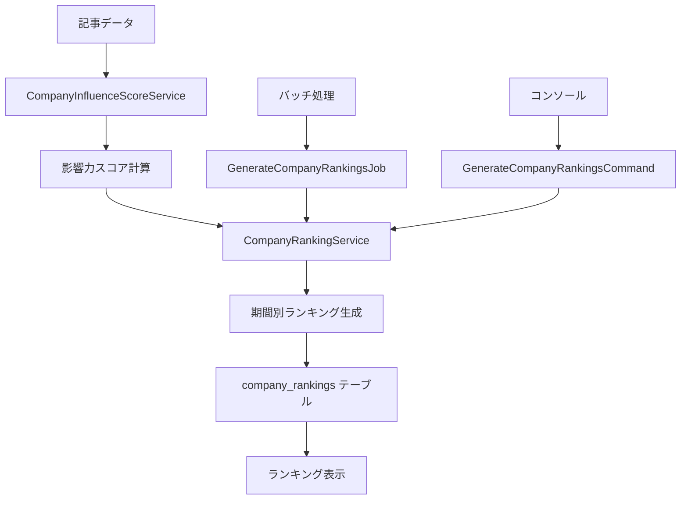

# 期間別ランキング機能

## 概要

企業の技術コミュニティでの影響力を7つの期間（1週間〜全期間）で定量化し、ランキング形式で提供する機能です。

## 機能仕様

### 対象期間

| 期間コード | 期間名 | 対象日数 |
|-----------|-------|----------|
| 1w        | 1週間  | 7日      |
| 1m        | 1ヶ月  | 30日     |
| 3m        | 3ヶ月  | 90日     |
| 6m        | 6ヶ月  | 180日    |
| 1y        | 1年    | 365日    |
| 3y        | 3年    | 1095日   |
| all       | 全期間 | 無制限   |

### 実装コンポーネント

#### 1. CompanyRankingService

**場所**: `app/Services/CompanyRankingService.php`

企業ランキングの生成・管理を行うサービスクラス

**主要メソッド**:
- `generateAllRankings()`: 全期間のランキング生成
- `generateRankingForPeriod()`: 特定期間のランキング生成
- `getRankingForPeriod()`: 期間別ランキング取得
- `getCompanyRankings()`: 企業別ランキング取得
- `getRankingStatistics()`: ランキング統計情報取得

#### 2. CompanyRanking モデル

**場所**: `app/Models/CompanyRanking.php`

企業ランキングデータのEloquentモデル

**主要スコープ**:
- `periodType()`: 期間タイプでフィルター
- `topRank()`: 上位ランクのみ取得
- `orderByRank()`: 順位順でソート
- `activeCompanies()`: アクティブな企業のみ

#### 3. GenerateCompanyRankingsJob

**場所**: `app/Jobs/GenerateCompanyRankingsJob.php`

ランキング生成のバックグラウンドジョブ

**機能**:
- 非同期でのランキング生成
- エラーハンドリング
- 処理状況のログ出力

#### 4. GenerateCompanyRankingsCommand

**場所**: `app/Console/Commands/GenerateCompanyRankingsCommand.php`

ランキング生成のコンソールコマンド

**使用例**:
```bash
# 全期間のランキング生成
php artisan company:generate-rankings

# 特定期間のランキング生成
php artisan company:generate-rankings --period=1m

# 基準日を指定
php artisan company:generate-rankings --date=2024-01-01

# キューで実行
php artisan company:generate-rankings --queue
```

## データフロー



## スコア計算アルゴリズム

### 基本スコア計算

影響力スコアは以下の要素を総合的に評価：

1. **記事の基本スコア**: 1.0（記事存在による基本点）
2. **ブックマーク数**: ブックマーク数 × 0.1
3. **いいね数**: いいね数 × 0.05
4. **プラットフォーム重み付け**:
   - Qiita: 1.0
   - Zenn: 1.0
   - はてなブックマーク: 0.8
5. **時系列重み付け**: 新しい記事ほど高スコア

### ランキング計算

1. 各企業の期間内記事を取得
2. 記事ごとのスコアを計算
3. 企業ごとに合計スコアを算出
4. スコア降順でランキング生成
5. 同スコアの場合は同順位を付与

## バッチ処理

### 定期実行

```bash
# crontab例（毎日深夜2時に実行）
0 2 * * * php /path/to/artisan company:generate-rankings --queue
```

### 手動実行

```bash
# 全期間のランキング生成
php artisan company:generate-rankings

# 特定期間のみ
php artisan company:generate-rankings --period=1m

# 統計情報表示
php artisan company:generate-rankings --period=all
```

## パフォーマンス最適化

### データベース最適化

- 適切なインデックスの設定
- Window関数による効率的な集計
- バッチ処理による大量データ処理

### 並行処理

- 各期間の処理を並行実行
- Laravel Queuesによる非同期処理
- メモリ効率の良いデータ処理

### キャッシュ戦略

- 計算結果の一時保存
- 頻繁にアクセスされるランキングの事前計算
- 統計情報のキャッシュ

## 使用方法

### プログラム内での使用

```php
use App\Services\CompanyRankingService;

// サービスの取得
$rankingService = app(CompanyRankingService::class);

// 特定期間のランキング取得
$rankings = $rankingService->getRankingForPeriod('1m', 20);

// 企業の全期間ランキング取得
$companyRankings = $rankingService->getCompanyRankings(1);

// 統計情報取得
$statistics = $rankingService->getRankingStatistics();
```

### ジョブでの使用

```php
use App\Jobs\GenerateCompanyRankingsJob;

// 特定期間のランキング生成をキューに追加
GenerateCompanyRankingsJob::dispatch('1m', now());

// 全期間のランキング生成
GenerateCompanyRankingsJob::dispatch();
```

## 監視・運用

### ログ出力

- 処理開始・完了時刻
- 処理対象企業数
- エラー発生時の詳細情報
- パフォーマンス指標

### 統計情報

- 期間別の企業数
- 平均・最高・最低スコア
- 総記事数・ブックマーク数
- 最終計算日時

## 関連ドキュメント

- [データベース設計](データベース設計.md)
- [企業影響力スコア計算](企業影響力スコア計算.md)
- [技術スタック](技術スタック.md)
- [開発フロー](開発フロー.md)